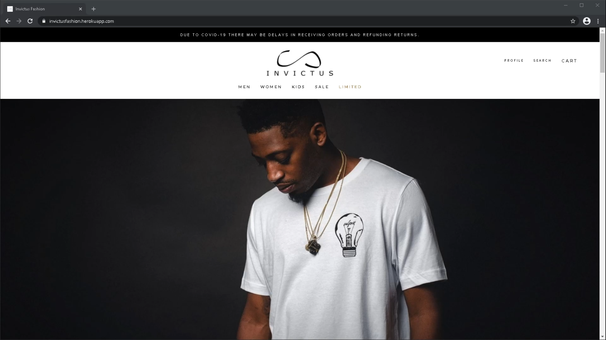

# Invictus Fashion

 &nbsp;
<br/>

[Demo](https://invictus.thezajac.com/) &nbsp; &nbsp; &nbsp; [Backend](https://github.com/oliver-za/invictus-backend) &nbsp; &nbsp; &nbsp; [Frontend](https://github.com/oliver-za/invictus-frontend) <br/>



**Description**<br />
👔 A fullstack fashion ecommerce application built using the MERN stack and more...

Invictus Fashion is a single-page application.<br/>
Client communicates with backend and database through Rest API.<br/>

Backend is powered by Node and Express.<br/>
Users are authenticated with JSON Web Token with expiration.<br/>
Passwords are encrypted with bcrypt library.<br/>
All data about items and orders are stored inside MongoDB database.<br/>
Backend uses mongoose library that makes MongoDB type casting, validation, query building, business logic, etc. more convenient.<br/>
All backend forms have implemented frontend and backend form validation.<br/>
Backend has prebuilt API endpoints for adding and removing items in the database.<br/>
Backend has endpoint for searching through all database connection based on the chosen substring.<br/>

Frontend is built with React.<br/>
Frontend utilizes lazy loading, prefetching and React.Suspense.<br/>
Main parts of application include unit tests and integration tests.<br/>
Includes Cypress E2E 'happy path' test.<br/>
Frontend utilizes React Hooks.<br/>
Frontend utilizes Context API for global state management.<br/>
For handling forms I chose library named 'react-hook-form' because it's really straightforward and it accompanies the 'hooks pattern'.<br/>
Parts of frontend untilize react-query library for convenient fetching and data caching.<br/>
All images have been reduced in size for faster loading times.<br/>
Application is responsive and mobile-friendly, includes sidedrawer.<br/>
Routing is handled on client side by 'react-router' and on invalid path, user is redirected to the home route.<br/>

<br/>

## Table of Contents

- [Features](#features)
- [Motivation](#motivation)
- [**Installation**](#installation)
- [Built With](#built-with)
- [Ideas for future releases](#ideas-for-future-releases)
- [License](#license)
- [Contact](#contact)

<br/>

## Features

- Authorization/Login/Register/Logout
- Slideshow
- Browse items by category
- Add/remove items from cart
- View more items by selected category
- Detail picture on hover
- View item properties on click
- Each item has its own id and link
- Sale category with price discounts
- Cart total cost
- Checkout
- User profile
- Past orders with order ID
- Search through products
- Responsive/mobile-friendly

<br/>

## Motivation

The idea behind building this application was to practice cloning an e-commerce application that will have all the main parts working while having a decent design. I have decided to build frontend with basic CSS, no CSS extensions such as SCSS or styled-components were used. Knowing React and enjoying writing JavaScript, I chose Node.js for backend. I have really enjoyed building this e-commerce application, particularly features such as authentication, search, forms and profile component.

<br/>

## Getting Started

### Installation

To run full application on your local machine follow these steps:

1. Clone or download the backend from the [backend repository](https://github.com/777pretty/invictus-backend).

2. Clone or download the frontend from the [frontend repository](https://github.com/777pretty/invictus-frontend).

3. Move frontend folder named 'client' inside the backend folder.

4. Change directory to the backend folder and install both backend and frontend dependencies with this one command:

   ```bash
   # with npm
   npm run iall

   # or with yarn
   yarn run iall
   ```

5. Create new file named ".env" at the root of the project folder.

6. Add these env variables to the .env file with the value of your MongoDB URI and change value of JWT_SECRET to anything you like (e.g. "4141500071"):
   ```javascript
   MONGODB_URI = "your-mongodb-uri";
   JWT_SECRET = "your-jwt-secret-can-be-any-string";
   ```
7. Start development mode with command:

   ```bash
   # with npm
   npm run dev

   # or with yarn
   yarn run dev
   ```

8. Run the application in the browser with url:
   ```javacript
   localhost:3000
   ```

<br />

## Built With

Frontend bootstrapped with create-react-app

**Backend dependencies**

- node
- express
- express-validator
- bcrypt
- jsonwebtoken
- mongoose
- compression
- dotenv

**Frontend dependenceis**

- react
- react-dom
- react-router-dom
- axios
- react-query
- react-hook-form

<br/>

## Ideas for future releases

- Finishing 'GET THE FIT' section
- Sending verification email through email service
- Newsletter popup with integrated mail service
- Invoice generated in PDF
- Connect application to stripe or similar payment services
- OAuth

<br/>

## License

This project is licensed under the [MIT License](https://github.com/777pretty/invictus-backend/blob/main/LICENSE)

<br/>

## Contact

With any ideas or questions...

You can contact me via email: oliverzaj@gmail.com <br/>
Or fill the contact form at my [personal website](https://thezajac.com)
